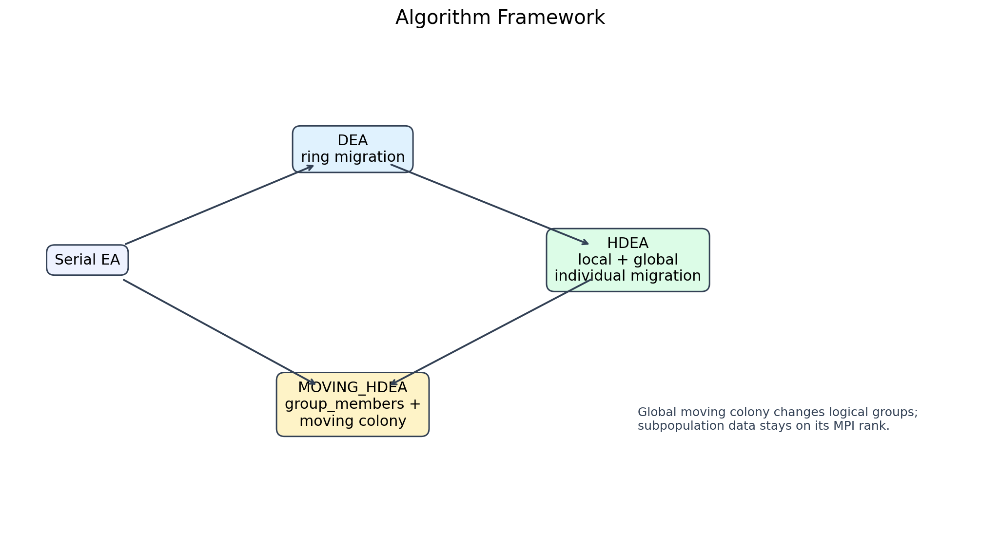
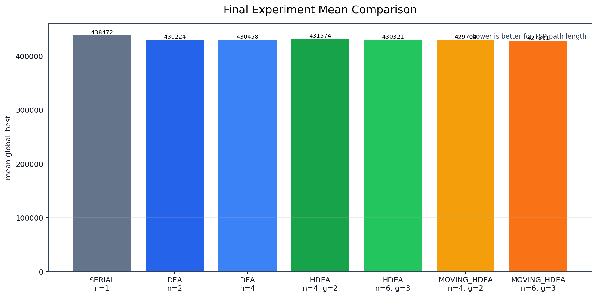
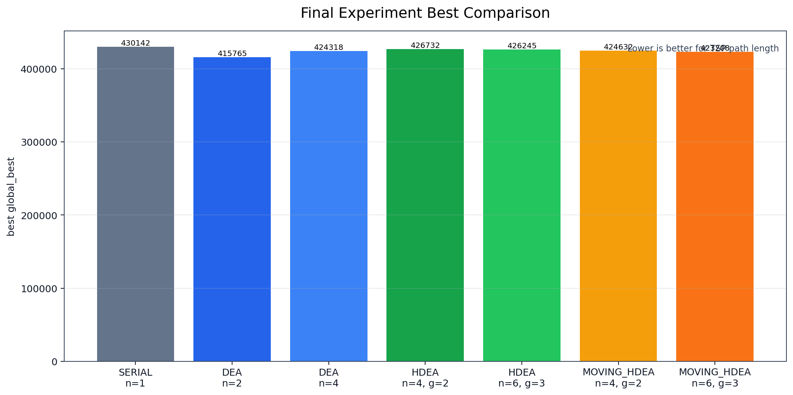
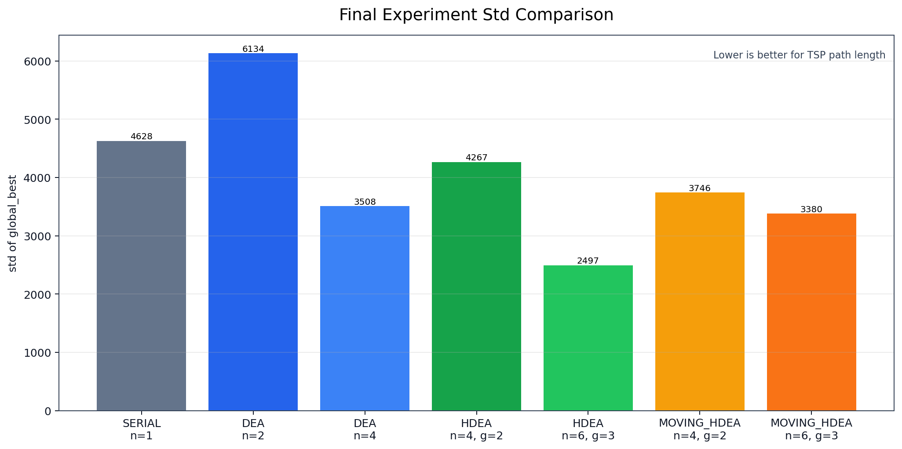
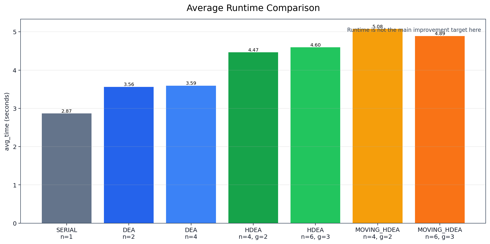
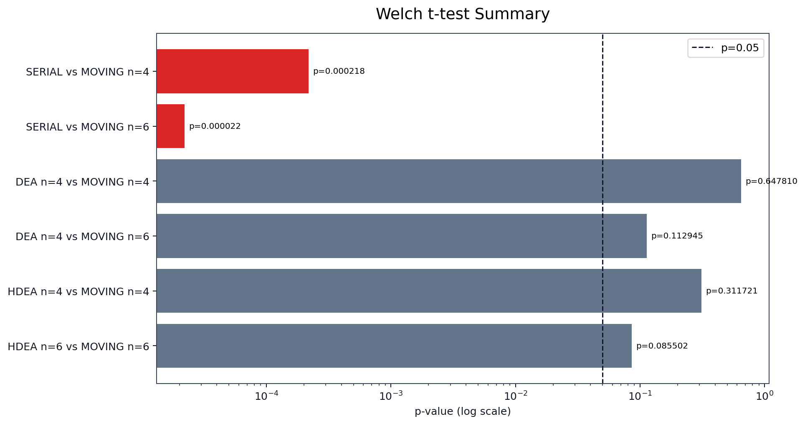
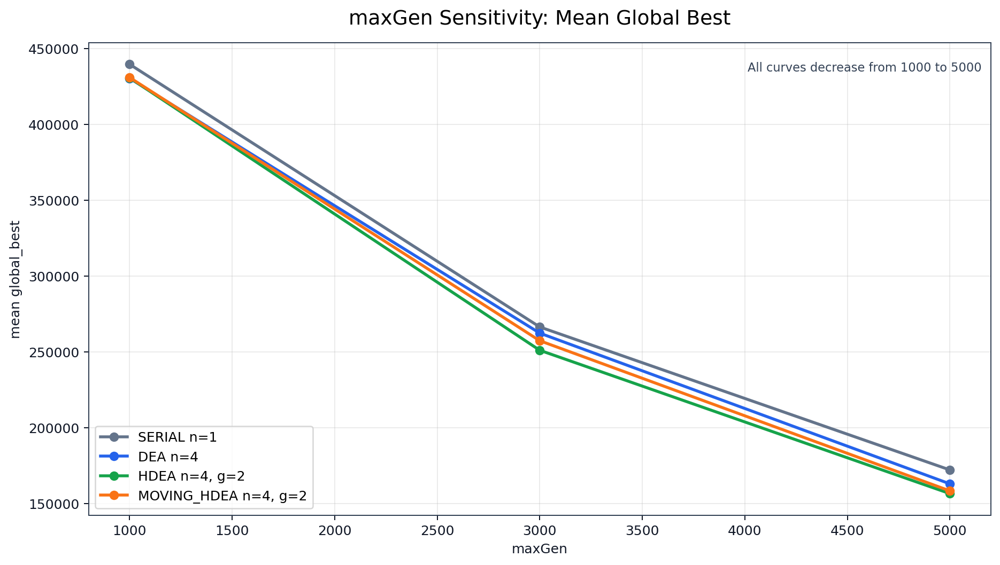

# 基于 MPI 的旅行商问题分层分布式进化算法并行化实验报告

## 摘要

本文围绕旅行商问题（Traveling Salesman Problem, TSP）的进化算法求解过程，基于老师提供的原始串行程序 `TSP0.C` 和 `pcb442.tsp` 数据集，完成了 MPI 并行化改造和多种分布式进化算法对比实验。原始程序采用固定规模种群、路径排列编码、距离矩阵预计算以及 inver-over / invert 类操作进行迭代搜索。本文首先对串行代码进行了可复现实验改造，保留原算法核心逻辑，同时增加命令行输入、seed 控制和 CSV 输出。随后实现了三类 MPI 并行进化算法：分布式进化算法 DEA、普通分层分布式进化算法 HDEA、以及基于 moving colony 的分层分布式进化算法 MOVING_HDEA。

正式实验在 `maxGen=1000`、10 个随机种子下进行，共包含 7 组算法配置、70 行实验结果。实验显示，所有被比较的并行算法相对于串行基线均取得更低的平均路径长度，并在 Welch t-test 中相对串行基线达到 `p<0.05` 的显著性水平。其中 `MOVING_HDEA n=6 groups=3` 获得最低平均路径长度 `427890.600`，`DEA n=2` 获得最低单次 best `415765`。但 MOVING_HDEA 相比 DEA 或普通 HDEA 的均值优势未达到 `p<0.05`，因此不能将其解释为相对其他并行算法的显著优势。

为进一步分析迭代预算影响，本文补充完成了 maxGen 敏感性实验。结果表明，SERIAL、DEA n=4、HDEA n=4 groups=2 和 MOVING_HDEA n=4 groups=2 在 `maxGen=1000 -> 3000 -> 5000` 过程中平均路径长度均持续下降，说明正式实验是在有限迭代预算下进行的相对性能比较，而非完全收敛后的最优解比较。本文最后讨论了总个体数不一致、样本规模有限、参数设置有限和通信开销等局限，并给出后续改进方向。

## 1. 问题背景与任务要求

### 1.1 旅行商问题简介

旅行商问题要求在给定若干城市及两两距离的情况下，寻找一条经过每个城市一次且最终回到起点的最短闭合路径。TSP 是典型的组合优化问题，搜索空间随城市数量呈阶乘级增长。对于 `pcb442.tsp` 中的 442 个城市，直接枚举所有排列不可行，因此需要启发式或进化式算法进行近似求解。

本课程大作业关注的重点不是证明 TSP 的理论复杂性，而是基于已有串行进化算法实现 MPI 并行化，并通过实验说明并行进化结构是否能够改善解质量。这里的“更好”主要指路径长度更短。由于 TSP 是最小化问题，本文所有 `best`、`mean` 和 `global_best` 指标均是越低越好。

### 1.2 原始串行代码与数据集

原始串行程序位于 `src/TSP0.C`。代码中设置 `CITY=442`、`N_COLONY=100`，与 `data/pcb442.tsp` 的城市规模匹配。数据文件第一行为城市数量：

```text
442
```

后续每行格式为：

```text
城市编号 x坐标 y坐标
```

例如数据文件开头为：

```text
1 2.00000e+02 4.00000e+02
2 2.00000e+02 5.00000e+02
3 2.00000e+02 6.00000e+02
```

串行程序读取城市坐标后预计算距离矩阵，再初始化 100 个排列个体。每个个体表示一条 TSP 路径，数组中的整数表示城市编号或城市下标顺序。

### 1.3 作业要求与本文完成内容

课程要求基于 MPI 对串行进化算法进行并行化，使并行化后的结果相对原始串行版本更好。参考论文提出了从 DEA 到 HDEA，再到 moving colony HDEA 的层次化并行进化思路。本文完成内容如下：

1. 保留原始 `TSP0.C`，新增可复现实验串行版本 `src/tsp_serial_exp.c`。
2. 实现 MPI DEA：`src/tsp_mpi_dea.c`。
3. 实现 MPI HDEA：`src/tsp_mpi_hdea.c`。
4. 实现 MPI MOVING_HDEA：`src/tsp_mpi_moving_hdea.c`。
5. 编写自动化实验脚本 `scripts/run_experiments_final.ps1` 和分析脚本 `scripts/analyze_results_final.py`。
6. 完成 70 次正式实验，生成 `results/final_experiment_results.csv`。
7. 对正式实验进行统计分析和 Welch t-test。
8. 完成 maxGen 收敛趋势补充实验，生成 `results/convergence_sensitivity_results.csv`。
9. 生成配套图表和最终报告初稿。

### 1.4 本文主要贡献

本文的主要工作体现在三个方面。第一，将原始串行进化算法改造成可复现实验框架，使输入、迭代代数、随机种子和输出文件均可由命令行控制。第二，在不改变核心进化操作的基础上设计了三类 MPI 并行结构，使每个 rank 维护一个本地子种群，通过不同迁移策略交换搜索信息。第三，通过 10 seed 正式实验和 3 seed maxGen 补充实验，给出了解质量、稳定性、运行时间、显著性和收敛趋势的综合分析。

## 2. 相关算法与论文思想

### 2.1 分布式进化算法 DEA

分布式进化算法 DEA 可以理解为岛模型。原始串行算法只有一个种群，而 DEA 将整体搜索拆成多个子种群。每个 MPI rank 独立维护一个本地种群，执行与串行算法相同的选择和变异操作。不同 rank 之间周期性迁移个体，从而在保留子种群独立搜索能力的同时共享局部优秀结构。

在本文实现中，DEA 使用环形拓扑：

```text
rank 0 -> rank 1 -> rank 2 -> rank 3 -> rank 0
```

每次迁移时，一个 rank 将本地最优个体发送给右邻居，同时从左邻居接收个体，并用接收到的个体替换本地最差个体。这样可以避免所有子种群过快同质化，同时让优良路径片段逐步扩散。

### 2.2 分层分布式进化算法 HDEA

HDEA 在 DEA 的基础上增加 group 层级。所有 rank 被划分为若干组，每个组内部较频繁地执行 local migration，组间较低频地执行 global migration。这样的设计使信息传播分为两层：组内传播更充分，组间传播更稀疏。

本文普通 HDEA 的全局迁移对象仍然是单个个体。即 rank 将本地最优个体发送给另一个 group 中对应位置的 rank，并用接收个体替换本地最差个体。它没有移动整个子种群，也不改变 rank 所属的逻辑 group。

### 2.3 Moving Colony HDEA

参考论文提出的 moving colony 思想将全局迁移对象从“单个个体”提升为“子种群或子种群所属关系”。其核心思想是：如果直接移动整个子种群数据，通信成本较高；但在 MPI 程序中可以通过改变逻辑分组映射来模拟子种群在 group 之间移动。这样，全局迁移阶段可以不发送个体，也不复制整个种群数组，只更新后续 local migration 使用的逻辑 group。

本文 MOVING_HDEA 使用 `groupMembers` 维护逻辑分组映射。例如 n=4、groups=2 时：

```text
initial:
group 0=[0,1], group 1=[2,3]

after moving colony:
group 0=[2,1], group 1=[0,3]

local migration changes from:
0<->1, 2<->3

to:
2<->1, 0<->3
```

这说明 moving colony 后的 local migration 通信对象确实发生变化。global moving colony 只改变逻辑分组，不迁移个体或整个种群数据。

### 2.4 本文实现与论文设置的关系

参考论文讨论了 hierarchical distributed evolutionary algorithms 中 global migration 对象从 individual 到 moving colony 的变化。本文实现的是适合课程作业规模的简化版本：DEA 采用 ring 个体迁移；HDEA 采用 group 内 local migration 和 group 间 individual global migration；MOVING_HDEA 采用 ring moving colony，通过 `groupMembers` 旋转逻辑分组关系。

本文没有声称完整复现论文全部实验设置，也没有实现论文中所有拓扑形式。尤其是 MOVING_HDEA 当前实现为 ring moving colony，没有实现 random moving colony。本文关注的是将论文思想转化为可运行 MPI 程序，并在 `pcb442.tsp` 上进行可复现实验对比。

因此，本文中的“复现”应理解为对 DEA、HDEA 和 moving colony HDEA 核心机制的课程项目实现，而不是对论文中全部数据集、全部参数组合和全部拓扑设置的逐项复刻。后续实验结论也只限定在当前代码、当前 `pcb442.tsp` 数据集、当前迁移参数和当前随机种子范围内。

## 3. 原始串行进化算法分析

### 3.1 数据读取与距离矩阵构造

原始程序首先读取城市数量 `xCity`，然后逐行读取城市编号、x 坐标和 y 坐标。修复后的实验版本使用：

```c
fscanf(fp, "%d%lf%lf", &cityId, &x, &y)
```

读取后，程序计算任意两个城市之间的欧氏距离，并存入距离矩阵。由于路径长度计算会在进化循环中频繁调用，提前构造距离矩阵可以避免重复计算坐标距离。

### 3.2 个体编码与种群初始化

每个个体是一组城市排列。对于 442 个城市，个体长度为 442。初始化时，程序先构造顺序城市数组，再通过随机交换生成不同个体。串行基线和每个 MPI rank 的本地子种群大小均为 `N_COLONY=100`。

这种设计使并行版本中的每个 rank 都保持与串行程序相同规模的本地搜索能力。相应地，n=4 的并行算法总个体数为 400，n=6 的并行算法总个体数为 600。这一点在公平性讨论中需要明确。

### 3.3 路径长度计算

路径长度由相邻城市之间的距离累加得到，并包含最后一个城市回到起点的距离。程序将每个个体的路径长度保存到 `dis_p`，并维护当前本地最优个体编号 `ibest` 和最优路径长度 `sumbest`。

### 3.4 inver-over / invert 进化操作

原始算法的主要进化操作类似 inver-over 思想。对每个个体，程序选择当前城市和目标城市，在路径排列中寻找对应位置，然后对一段路径执行反转。反转操作可以改变路径局部结构，是 TSP 启发式搜索中常见的邻域调整方式。

本文并行化没有重写这部分算法。DEA、HDEA 和 MOVING_HDEA 都沿用本地进化逻辑，只在固定代数间隔加入 MPI 迁移操作。这保证了并行算法相对串行算法的差异主要来自多子种群和迁移策略，而不是来自完全不同的局部搜索算子。

### 3.5 选择策略

每次产生新个体后，程序比较新路径长度与原路径长度。如果新个体更短，则替换原个体；否则保留原个体。迁移阶段接收到的个体则用于替换本地最差个体，从而将外部优秀结构引入本地子种群。

### 3.6 串行基线的可复现改造

新增的 `src/tsp_serial_exp.c` 支持命令行参数：

```powershell
bin\tsp_serial_exp.exe data\pcb442.tsp 1000 12345 results\temp_serial.csv
```

其中参数依次为输入数据、`maxGen`、随机种子和输出 CSV。该版本保留串行算法核心逻辑，同时输出统一字段：

```csv
algorithm,nproc,maxGen,migration_interval,local_to_global_ratio,num_groups,base_seed,global_best,elapsed_sec
```

## 4. MPI 并行算法设计

### 4.1 总体并行框架

三类并行算法都遵循同一总体框架：每个 MPI rank 读取同一份 TSP 数据，构造距离矩阵，初始化本地 100 个个体，并独立执行本地进化。不同算法的差异体现在迁移对象、迁移拓扑和迁移频率。



图 1 展示了本文从串行 EA 到 DEA、HDEA 和 MOVING_HDEA 的扩展关系。DEA 引入多子种群和 ring migration；HDEA 引入 group 层级和两级迁移；MOVING_HDEA 进一步将全局迁移改为逻辑分组移动。

### 4.2 DEA：环形岛模型

DEA 的伪代码如下：

```text
for each MPI rank:
    read TSP data
    initialize local colony
    for GenNum in 1..maxGen:
        evolve local colony
        if GenNum % migration_interval == 0:
            send local best to right neighbor
            receive path from left neighbor
            replace local worst individual
    gather all local best values at rank 0
    rank 0 writes global best to CSV
```

通信上，DEA 使用 `MPI_Sendrecv` 同时处理发送和接收，避免简单阻塞 `MPI_Send` / `MPI_Recv` 顺序造成死锁。最终使用 `MPI_Gather` 收集各 rank 的本地最优值，并在 rank 0 计算全局最优。

### 4.3 HDEA：局部迁移与全局迁移

HDEA 将 rank 划分为 group。以 n=4、groups=2 为例：

```text
group 0: rank 0 <-> rank 1
group 1: rank 2 <-> rank 3

local migration: group 内
global migration: group 间相同 local_id 的 rank
```

HDEA 的伪代码如下：

```text
for each MPI rank:
    group_id = rank / subpops_per_group
    local_id = rank % subpops_per_group
    initialize local colony
    for GenNum in 1..maxGen:
        evolve local colony
        if GenNum % local_migration_interval == 0:
            migrate individual inside group
            local_migration_count += 1
            if local_migration_count % local_to_global_ratio == 0:
                migrate individual between groups
    gather local best values
```

在普通 HDEA 中，local migration 和 global migration 都迁移单个个体，即发送本地最优个体，接收后替换本地最差个体。

### 4.4 MOVING_HDEA：移动子种群的逻辑分组

MOVING_HDEA 与普通 HDEA 的主要区别在 global migration。普通 HDEA 的全局迁移发送个体；MOVING_HDEA 的 global moving colony 不发送个体，而是更新 `groupMembers` 映射。

关键逻辑可概括为：

```text
group_members[g][i] = 当前逻辑 group g 中位置 i 对应的 MPI rank

global moving colony:
    tmp = group_members[last_group][moving_position]
    group_members[g][moving_position] = group_members[g-1][moving_position]
    group_members[0][moving_position] = tmp
    moving_position = (moving_position + 1) % subpops_per_group

next local migration:
    根据新的 group_members 查找当前 rank 的 logical_group 和 logical_pos
    在新的 logical_group 内执行 local migration
```

这种实现符合论文中“通过重新分组实现 moving colony，减少全局迁移通信”的思想。由于各 rank 以相同确定性规则更新 `groupMembers`，不需要额外广播分组表。

### 4.5 三种并行算法的对比

| 算法 | 分组结构 | local migration | global migration | 全局阶段通信对象 |
|---|---|---|---|---|
| DEA | 无 group，所有 rank 一个 ring | 无单独层级 | ring 个体迁移 | 单个个体 |
| HDEA | rank 划分为 group | group 内个体迁移 | group 间个体迁移 | 单个个体 |
| MOVING_HDEA | 使用 `groupMembers` 逻辑分组 | 基于当前逻辑 group 执行 | 更新逻辑分组 | 逻辑子种群归属 |

## 5. MPI 实现细节

### 5.1 程序文件结构

| 文件 | 作用 |
|---|---|
| `src/TSP0.C` | 原始串行程序 |
| `src/tsp_serial_exp.c` | 可复现实验串行版本 |
| `src/tsp_mpi_dea.c` | DEA 并行版本 |
| `src/tsp_mpi_hdea.c` | HDEA 并行版本 |
| `src/tsp_mpi_moving_hdea.c` | MOVING_HDEA 并行版本 |
| `scripts/run_experiments_final.ps1` | 正式 70 次实验脚本 |
| `scripts/analyze_results_final.py` | 正式实验统计分析脚本 |
| `scripts/run_convergence_sensitivity.ps1` | maxGen 补充实验脚本 |
| `scripts/analyze_convergence_sensitivity.py` | maxGen 补充实验分析脚本 |
| `scripts/generate_report_figures.py` | 报告图表生成脚本 |

### 5.2 参数设计与可复现随机种子

正式实验使用 10 个 seed：

```text
12345, 22345, 32345, 42345, 52345, 62345, 72345, 82345, 92345, 102345
```

MPI 版本中每个 rank 的随机种子由基础 seed 派生：

```text
rankSeed = baseSeed + rank * 10007
```

这样可以保证不同 rank 初始种群不同，同时同一组实验可复现。

### 5.3 MPI 通信设计

三类并行算法的个体迁移均使用 `MPI_Sendrecv`，这使每个 rank 可以在一个调用中完成发送和接收。最终统计阶段使用：

```text
MPI_Gather: 收集各 rank 的 local best
MPI_Reduce: 统计所有 rank 中的最大 elapsed_sec 作为并行运行时间
```

对 MOVING_HDEA 而言，global moving colony 本身不调用 `MPI_Sendrecv`。只有后续 local migration 会根据新的逻辑分组继续执行个体交换。

### 5.4 结果收集与 CSV 输出

所有实验统一输出字段：

```csv
algorithm,nproc,maxGen,migration_interval,local_to_global_ratio,num_groups,base_seed,global_best,elapsed_sec
```

rank 0 负责写入 CSV。对于 MPI 程序，`elapsed_sec` 使用所有 rank 中最大的本地运行时间，这样可以反映整个并行作业完成所需时间。

### 5.5 运行脚本与自动化实验

正式实验脚本会编译串行程序和三个 MPI 程序，然后按算法配置和 seed 逐次运行。脚本在每次运行后读取临时 CSV 的最后一行，并追加到统一结果文件。若编译、运行、行数检查或数值检查失败，脚本会停止并报错，不会静默跳过。

## 6. 实验设计

### 6.1 实验环境与编译方式

当前 Windows 环境使用 MinGW gcc 与 MS-MPI SDK 编译 MPI 程序。MPI 程序编译形式为：

```powershell
gcc -std=c11 -Wall -Wextra -O2 -I%MSMPI_INC% src\tsp_mpi_dea.c -L%MSMPI_LIB64% -lmsmpi -lm -o bin\tsp_mpi_dea.exe
```

实验脚本会自动检测 `mpicc`；若没有 `mpicc`，则使用 gcc 加 MS-MPI SDK 编译。

### 6.2 数据集与评价指标

数据集为 `pcb442.tsp`，共 442 个城市。评价指标包括：

| 指标 | 含义 |
|---|---|
| best | 该算法配置 10 次运行中的最小 `global_best` |
| mean | 10 次运行的平均 `global_best` |
| std | 10 次运行的样本标准差 |
| avg_time | 平均运行时间 |
| p-value | Welch t-test 双侧检验结果 |

TSP 是最小化问题，因此 `best` 和 `mean` 越小表示路径越短。

### 6.3 正式实验参数

| algorithm | nproc | migration_interval | local_to_global_ratio | num_groups | count |
|---|---:|---:|---:|---:|---:|
| SERIAL | 1 | 0 | 0 | 0 | 10 |
| DEA | 2 | 100 | 0 | 0 | 10 |
| DEA | 4 | 100 | 0 | 0 | 10 |
| HDEA | 4 | 100 | 5 | 2 | 10 |
| HDEA | 6 | 100 | 5 | 3 | 10 |
| MOVING_HDEA | 4 | 100 | 5 | 2 | 10 |
| MOVING_HDEA | 6 | 100 | 5 | 3 | 10 |

正式实验共 7 组配置，每组 10 个 seed，共 70 行结果。

### 6.4 Welch t-test 统计检验方法

本文使用 Welch t-test 比较不同算法配置的 `global_best` 均值差异。Welch t-test 不要求两组样本方差相等，适合本实验中不同算法运行结果方差可能不同的情况。显著性阈值取 `0.05`。由于每组只有 10 个样本，统计结论仍应谨慎解释。

### 6.5 公平性边界说明

当前实验每个 rank 都维护 `N_COLONY=100` 个体，因此并行算法的总个体数随 nproc 增加：

| 配置 | 总个体数 |
|---|---:|
| SERIAL n=1 | 100 |
| DEA n=2 | 200 |
| DEA n=4 | 400 |
| HDEA n=4 | 400 |
| HDEA n=6 | 600 |
| MOVING_HDEA n=4 | 400 |
| MOVING_HDEA n=6 | 600 |

因此，SERIAL 与并行算法不是严格固定总计算预算比较，n=6 与 n=4 也不是严格同规模比较。更公平的同规模比较是 `DEA n=4`、`HDEA n=4 groups=2`、`MOVING_HDEA n=4 groups=2` 之间，以及 `HDEA n=6 groups=3` 与 `MOVING_HDEA n=6 groups=3` 之间。

### 6.6 结果来源与保护原则

本文中的正式统计数字优先来自 `results/final_analysis_summary.csv` 和 `results/final_analysis_summary.txt`，正式实验原始数据来自 `results/final_experiment_results.csv`。这些文件对应 7 组配置、每组 10 个 seed 的 70 行正式实验结果，是最终报告的主要依据。

收敛趋势相关数字来自 `results/convergence_sensitivity_summary.csv` 和 `results/convergence_sensitivity_summary.txt`，其作用是说明 `maxGen` 对搜索质量的影响，不替代正式 70 次实验。报告撰写时不手工改写 CSV 结果，不用小样本补充实验推翻正式统计结论，也不把运行时间解释为当前项目的主要优化成果。

## 7. 正式实验结果与分析

### 7.1 70 次正式实验结果总表

正式实验统计结果来自 `results/final_analysis_summary.csv`。

| algorithm | nproc | groups | ratio | best | mean | std | avg_time |
|---|---:|---:|---:|---:|---:|---:|---:|
| SERIAL | 1 | 0 | 0 | 430142 | 438472.100 | 4628.069 | 2.869 |
| DEA | 2 | 0 | 0 | 415765 | 430223.600 | 6134.273 | 3.563 |
| DEA | 4 | 0 | 0 | 424318 | 430458.000 | 3508.236 | 3.595 |
| HDEA | 4 | 2 | 5 | 426732 | 431573.700 | 4266.830 | 4.466 |
| HDEA | 6 | 3 | 5 | 426245 | 430320.900 | 2496.949 | 4.597 |
| MOVING_HDEA | 4 | 2 | 5 | 424632 | 429704.000 | 3745.679 | 5.077 |
| MOVING_HDEA | 6 | 3 | 5 | 423208 | 427890.600 | 3380.349 | 4.893 |

### 7.2 平均路径长度比较



图 2 显示，所有并行算法的平均路径长度均低于 SERIAL。最低平均值来自 `MOVING_HDEA n=6 groups=3`，为 `427890.600`。这说明在当前统一迭代预算下，分布式多子种群结构能够改善搜索质量。

需要注意，`MOVING_HDEA n=6 groups=3` 使用 6 个 rank，总个体数为 600，因此不应直接与 n=4 算法解释为完全同规模比较。在 n=4 同规模配置中，`MOVING_HDEA n=4 groups=2` 的 mean 为 `429704.000`，低于 `DEA n=4` 的 `430458.000`，也低于 `HDEA n=4 groups=2` 的 `431573.700`。

### 7.3 最优路径长度比较



图 3 显示，最低单次 best 来自 `DEA n=2`，值为 `415765`。这说明单次最优结果和平均最优结果并不完全一致。最终报告不能只依据单次 best 判断某算法整体最好，而应结合 mean、std 和 t-test。

### 7.4 标准差与稳定性分析



标准差反映 10 次独立运行结果的波动程度。`HDEA n=6 groups=3` 的 std 为 `2496.949`，在正式实验中最低，说明该配置在本实验中波动较小。`DEA n=2` 的 std 为 `6134.273`，说明虽然其单次 best 很好，但运行结果波动较大。

MOVING_HDEA 两组的 std 分别为 `3745.679` 和 `3380.349`，稳定性处于中间水平。结合 mean 可以看出，MOVING_HDEA 的优势主要体现在平均路径长度较低，而不是所有稳定性指标都最优。

### 7.5 运行时间分析



图 5 显示，当前小规模实验中并行程序的平均运行时间不低于串行版本。主要原因包括 MPI 进程启动、进程间通信、每个 rank 都维护完整本地种群、以及本实验运行在单机 Windows 环境中。本文的主要优化目标是改善解质量，而不是证明运行时间加速。

因此，最终结论应表述为：MPI 并行进化结构提高了固定迭代预算下的搜索质量；当前实验不支持“并行版本显著缩短运行时间”的说法。

### 7.6 Welch t-test 结果分析



正式实验的主要 t-test 结果如下：

| comparison | mean_left | mean_right | p-value | 结论 |
|---|---:|---:|---:|---|
| SERIAL n=1 vs DEA n=2 | 438472.100 | 430223.600 | 0.003512 | DEA n=2 相对 SERIAL 显著更低 |
| SERIAL n=1 vs DEA n=4 | 438472.100 | 430458.000 | 0.000435 | DEA n=4 相对 SERIAL 显著更低 |
| SERIAL n=1 vs HDEA n=4 groups=2 | 438472.100 | 431573.700 | 0.002782 | HDEA n=4 相对 SERIAL 显著更低 |
| SERIAL n=1 vs HDEA n=6 groups=3 | 438472.100 | 430320.900 | 0.000242 | HDEA n=6 相对 SERIAL 显著更低 |
| SERIAL n=1 vs MOVING_HDEA n=4 groups=2 | 438472.100 | 429704.000 | 0.000218 | MOVING_HDEA n=4 相对 SERIAL 显著更低 |
| SERIAL n=1 vs MOVING_HDEA n=6 groups=3 | 438472.100 | 427890.600 | 0.000022 | MOVING_HDEA n=6 相对 SERIAL 显著更低 |
| DEA n=4 vs MOVING_HDEA n=4 groups=2 | 430458.000 | 429704.000 | 0.647810 | MOVING_HDEA n=4 均值更低，但差异不显著 |
| DEA n=4 vs MOVING_HDEA n=6 groups=3 | 430458.000 | 427890.600 | 0.112945 | MOVING_HDEA n=6 均值更低，但差异不显著 |
| HDEA n=4 groups=2 vs MOVING_HDEA n=4 groups=2 | 431573.700 | 429704.000 | 0.311721 | MOVING_HDEA n=4 均值更低，但差异不显著 |
| HDEA n=6 groups=3 vs MOVING_HDEA n=6 groups=3 | 430320.900 | 427890.600 | 0.085502 | MOVING_HDEA n=6 均值更低，但差异不显著 |

由此可得：三类并行算法均相对串行基线表现出统计显著的更低平均路径长度；MOVING_HDEA 相比 DEA 和 HDEA 有均值优势，但该优势未达到 `p<0.05`。因此，本文只将 MOVING_HDEA 描述为“均值上表现出更好趋势”，不将其描述为相对 DEA/HDEA 的显著性优势。

其中与 MOVING_HDEA 相关的关键 p-value 为：`SERIAL n=1 vs MOVING_HDEA n=6 groups=3` 的 `p=0.000022`，说明 MOVING_HDEA n=6 相对串行基线显著更低；`DEA n=4 vs MOVING_HDEA n=4 groups=2` 的 `p=0.647810`，说明 MOVING_HDEA n=4 虽然均值更低，但与 DEA n=4 的差异不显著。

## 8. 收敛趋势补充实验

### 8.1 补充实验目的

正式实验统一使用 `maxGen=1000`。为了判断该迭代预算是否足以充分收敛，本文补充进行了 `maxGen=1000`、`3000`、`5000` 的敏感性实验。补充实验只选择 4 组同 n=4 配置，每组 3 个 seed，因此只用于趋势分析，不替代正式 70 次实验的 t-test 结论。

### 8.2 maxGen 敏感性实验结果



| algorithm | mean@1000 | mean@3000 | mean@5000 | improvement_abs | improvement_pct |
|---|---:|---:|---:|---:|---:|
| SERIAL n=1 | 439479.000 | 266350.000 | 172132.667 | 267346.333 | 60.833% |
| DEA n=4 | 430230.333 | 262287.000 | 162953.333 | 267277.000 | 62.124% |
| HDEA n=4 groups=2 | 430536.000 | 250983.667 | 156517.667 | 274018.333 | 63.646% |
| MOVING_HDEA n=4 groups=2 | 430791.333 | 257274.333 | 158328.000 | 272463.333 | 63.247% |

### 8.3 收敛趋势分析

四个算法随着 maxGen 增大，mean 均持续下降。这说明 `maxGen=1000` 下算法尚未充分收敛，增加迭代预算后仍然可以继续改善路径长度。从 `1000` 到 `5000`，四个算法的平均路径长度改善比例约为 `60.833%` 到 `63.646%`。

在 `maxGen=5000` 下，平均结果最好的是 `HDEA n=4 groups=2`，mean 为 `156517.667`；其次为 `MOVING_HDEA n=4 groups=2`，mean 为 `158328.000`；DEA n=4 为 `162953.333`；SERIAL 为 `172132.667`。三个并行算法在较大 maxGen 下仍低于 SERIAL，说明并行子种群结构在较长运行预算下仍保持解质量优势。

### 8.4 与正式实验结论的关系

补充实验说明正式实验的 `maxGen=1000` 是统一迭代预算，而不是完全收敛条件。因此，本文不声称算法求得 TSPLIB 已知最优解，也不声称当前路径已经是最终可达到的最好结果。正式实验的意义在于：在相同 `maxGen=1000` 设置下，不同 MPI 并行策略对搜索质量产生了可观察差异。

由于补充实验每组只有 3 个 seed，不能用它推翻 10 seed 正式实验结论，也不能据此重新做强显著性判断。它的作用是为报告提供收敛性边界。

## 9. 综合讨论

### 9.1 为什么并行算法优于串行算法

并行算法结果优于串行基线的主要原因不是简单的运行时间加速，而是搜索结构变化。串行算法只有一个种群，容易在有限迭代中受到初始随机结构影响。DEA、HDEA 和 MOVING_HDEA 同时维护多个子种群，不同 rank 以不同随机种子演化，可以探索更多区域。

迁移机制进一步将局部优秀个体或子种群结构传播到其他 rank。接收方用迁移个体替换最差个体，可以快速引入更优路径片段。多子种群独立搜索和周期性迁移结合，使并行算法在固定迭代预算下更容易得到较短路径。

### 9.2 为什么 MOVING_HDEA 取得最低平均值

正式实验中最低 mean 来自 `MOVING_HDEA n=6 groups=3`，为 `427890.600`。其可能原因是 moving colony 改变了后续 local migration 的对象，使一个子种群可以进入新的逻辑 group 并持续影响新的邻居。相比普通 HDEA 的单次 global individual migration，moving colony 不是只传递一个个体，而是改变后续局部信息传播关系。

不过，这一解释应保持谨慎。MOVING_HDEA n=6 同时使用 6 个 rank，总个体数为 600。其优势既可能来自 moving colony 机制，也可能部分来自更大的并行种群规模。

### 9.3 为什么 MOVING_HDEA 未在统计上压过 DEA/HDEA

虽然 MOVING_HDEA 的 mean 低于 DEA n=4 和对应 HDEA 配置，但 t-test 的 p-value 分别为 `0.647810`、`0.112945`、`0.311721` 和 `0.085502`，均大于 0.05。这说明在 10 seed 的样本下，差异不足以排除随机波动影响。

可能原因包括：样本数量只有 10；算法结果本身波动较大；`maxGen=1000` 尚未充分收敛；当前迁移参数未必是 MOVING_HDEA 的最优参数。因此，最终结论只能写为 MOVING_HDEA 在均值上表现出优势趋势，不能写成相对 DEA 或 HDEA 的显著性优势。

### 9.4 当前实验未完全收敛的影响

maxGen 补充实验显示，四个算法在 5000 代仍比 1000 代有明显改善。这意味着正式实验比较的是有限迭代预算下的搜索质量，而不是充分收敛后的最终水平。该结论影响两点解释：第一，不能把 1000 代结果视为算法极限性能；第二，不同算法在更长迭代下的排序可能发生变化。

因此，本文报告中所有结论均限定在当前参数、当前数据集和当前迭代预算范围内。

### 9.5 通信成本与实现复杂度分析

DEA 实现最简单，只需要一个全局 ring。HDEA 增加 group 和 local/global 两级迁移，参数更多，代码复杂度增加。MOVING_HDEA 又增加逻辑分组映射 `groupMembers`，需要保证所有 rank 对映射更新保持一致。

从通信角度看，DEA 和 HDEA 的迁移阶段需要发送个体路径数组；MOVING_HDEA 的 global moving colony 不发送个体，只更新逻辑分组。理论上这可以降低全局迁移通信成本，但当前实验规模较小，运行时间主要受 MPI 启动、进程调度和本地计算影响，因此没有体现出运行时间优势。

## 10. 局限性与改进方向

### 10.1 计算预算公平性问题

当前实验每个 rank 都保留 100 个体，因此并行算法总个体数高于串行基线。这有利于满足课程要求中“并行化后结果更好”的目标，但不是严格固定总个体数或固定函数评价次数的公平比较。若要更严格，应补充固定总种群规模实验，例如让 n=4 时每个 rank 只维护 25 个体。

### 10.2 实验规模限制

正式实验每组 10 个 seed，补充实验每组 3 个 seed。对于课程作业而言已经能支持基本统计分析，但如果要发表级结论，需要更多 seed、更多 TSP 实例和更系统的参数搜索。

### 10.3 参数设置限制

本文固定了 `migration_interval=100` 和 `local_to_global_ratio=5`，没有系统搜索迁移频率、group 数量、moving position 策略等参数。不同参数可能显著影响 HDEA 和 MOVING_HDEA 表现。

### 10.4 后续可改进方向

后续可以从四个方向改进：第一，加入固定总种群规模或固定评价次数实验；第二，扩展到更多 TSPLIB 实例；第三，比较 ring、random、mesh 等不同迁移拓扑；第四，记录每代最优值，绘制更细粒度的收敛曲线，而不只是比较几个 maxGen 终点。

## 11. 总结

本文完成了基于 MPI 的 TSP 进化算法并行化实验。实现层面，本文保留了原始串行进化算法核心操作，新增了可复现实验串行版本，并实现 DEA、HDEA、MOVING_HDEA 三类并行算法。实验层面，本文完成 7 组算法配置、每组 10 个 seed 的正式实验，并使用 Welch t-test 分析显著性。结果表明，三类并行算法相对串行基线均取得更低平均路径长度，并达到统计显著水平。

正式实验中，`MOVING_HDEA n=6 groups=3` 获得最低平均路径长度 `427890.600`，说明 moving colony 策略在当前实验中表现出较好趋势。然而，MOVING_HDEA 相比 DEA/HDEA 的差异未达到 `p<0.05`，因此本文不夸大其显著性优势。maxGen 补充实验进一步说明，当前 `maxGen=1000` 尚未充分收敛，正式实验应理解为统一迭代预算下的相对比较。

总体而言，本文实现了从串行 EA 到 DEA、HDEA 和 MOVING_HDEA 的逐级并行化，完成了可复现实验和统计分析，能够支撑课程大作业关于 MPI 并行进化算法设计、实现和实验评价的要求。

## 参考文献

[1] Chengjun Li, Guangdao Hu. Global migration strategy with moving colony for hierarchical distributed evolutionary algorithms. Soft Computing, 2014, 18:2161-2176.

[2] `docs/hierarchical.pdf`，课程提供参考论文。

[3] `data/pcb442.tsp`，课程提供 TSP 数据集。

## 附录 A：主要运行命令

正式实验：

```powershell
powershell -NoProfile -ExecutionPolicy Bypass -File .\scripts\run_experiments_final.ps1
python .\scripts\analyze_results_final.py .\results\final_experiment_results.csv
python .\scripts\generate_report_figures.py
```

收敛趋势补充实验：

```powershell
powershell -NoProfile -ExecutionPolicy Bypass -File .\scripts\run_convergence_sensitivity.ps1
python .\scripts\analyze_convergence_sensitivity.py .\results\convergence_sensitivity_results.csv
```

单次运行命令示例：

```powershell
bin\tsp_serial_exp.exe data\pcb442.tsp 1000 12345 results\temp_serial.csv

mpiexec -n 4 bin\tsp_mpi_dea.exe data\pcb442.tsp 1000 100 12345 results\temp_dea.csv

mpiexec -n 4 bin\tsp_mpi_hdea.exe data\pcb442.tsp 1000 100 5 2 12345 results\temp_hdea.csv

mpiexec -n 4 bin\tsp_mpi_moving_hdea.exe data\pcb442.tsp 1000 100 5 2 12345 results\temp_moving_hdea.csv
```

## 附录 B：核心伪代码

DEA：

```text
initialize MPI
each rank reads TSP data and initializes local colony
for generation in 1..maxGen:
    evolve local colony
    if generation % migration_interval == 0:
        send local best to next rank
        receive path from previous rank
        replace local worst individual
rank 0 gathers local best values and writes global best
```

HDEA：

```text
divide ranks into groups
for generation in 1..maxGen:
    evolve local colony
    if generation % local_migration_interval == 0:
        migrate individual inside group
        if local_migration_count % local_to_global_ratio == 0:
            migrate individual between groups
rank 0 gathers local best values and writes global best
```

MOVING_HDEA：

```text
initialize group_members
for generation in 1..maxGen:
    evolve local colony
    if generation % local_migration_interval == 0:
        find current logical group from group_members
        migrate individual inside logical group
        if local_migration_count % local_to_global_ratio == 0:
            rotate group_members at moving_position
            moving_position = next position
rank 0 gathers local best values and writes global best
```

## 附录 C：项目文件说明

| 路径 | 说明 |
|---|---|
| `src/TSP0.C` | 原始串行代码 |
| `src/tsp_serial_exp.c` | 可复现实验串行代码 |
| `src/tsp_mpi_dea.c` | DEA MPI 代码 |
| `src/tsp_mpi_hdea.c` | HDEA MPI 代码 |
| `src/tsp_mpi_moving_hdea.c` | MOVING_HDEA MPI 代码 |
| `scripts/run_experiments_final.ps1` | 正式实验运行脚本 |
| `scripts/analyze_results_final.py` | 正式实验统计脚本 |
| `scripts/run_convergence_sensitivity.ps1` | maxGen 补充实验脚本 |
| `scripts/analyze_convergence_sensitivity.py` | maxGen 补充实验统计脚本 |
| `scripts/generate_report_figures.py` | 报告图表生成脚本 |
| `results/final_experiment_results.csv` | 70 次正式实验原始结果 |
| `results/final_analysis_summary.csv` | 正式实验统计结果 |
| `results/convergence_sensitivity_results.csv` | 收敛趋势补充实验原始结果 |
| `results/convergence_sensitivity_summary.csv` | 收敛趋势统计结果 |
| `reports/assets/` | 报告配套图表 |

主要图表文件包括：

```text
reports/assets/fig_algorithm_framework.png
reports/assets/fig_final_mean_comparison.png
reports/assets/fig_final_best_comparison.png
reports/assets/fig_final_std_comparison.png
reports/assets/fig_final_time_comparison.png
reports/assets/fig_convergence_trend.png
reports/assets/fig_ttest_summary.png
```
