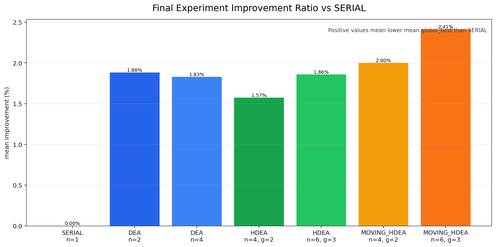
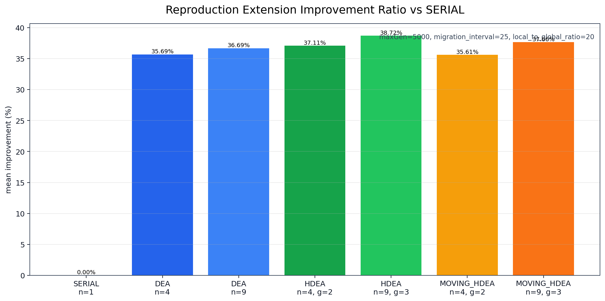

# 基于 MPI 的旅行商问题双路线综合实验报告

## 摘要

本文围绕旅行商问题（Traveling Salesman Problem, TSP）的并行求解展开，最终形成 Version A 和 Version B 两条互补路线。Version A 基于课程提供的原始串行程序 `src/TSP0.C`，在保留原始进化算法核心操作的基础上，新增可复现实验串行版本 `src/tsp_serial_exp.c`，并实现三类 MPI 并行进化算法：分布式进化算法 DEA、普通分层分布式进化算法 HDEA、以及基于 moving colony 思想的 MOVING_HDEA。Version B 则位于 `src_scratch/`，是完全独立实现的 `SCRATCH_ILS_2OPT` 路线，不参考老师代码，也不复制 Version A 的算法实现；它使用独立 parser、整数欧氏距离矩阵、tour 合法性检查、随机贪心初始化、double-bridge perturbation 和 repeated 2-opt 局部搜索。

正式实验使用 `pcb442.tsp`，在 `maxGen=1000`、10 个随机种子、7 组算法配置下得到 70 行结果。统计结果显示，所有被比较的并行配置相对 SERIAL 均取得更低的平均 `global_best`，并且在 Welch t-test 中相对 SERIAL 达到 `p<0.05`。其中 `MOVING_HDEA n=6 groups=3` 的 mean 最低，为 `427890.600`；`DEA n=2` 的单次 best 最低，为 `415765`。但是，MOVING_HDEA 相对 DEA 或 HDEA 的 pairwise 差异未达到 `p<0.05`，因此本文只将其表述为在当前设置下具有均值优势趋势，而不扩大为对其他并行算法的显著优势。

为增强报告的学术完整性，本文还使用已有 `maxGen` 敏感性实验和新增 `reproduction_extension` 补强实验。收敛趋势实验显示，SERIAL、DEA n=4、HDEA n=4 groups=2 和 MOVING_HDEA n=4 groups=2 在 `maxGen=1000 -> 3000 -> 5000` 时 mean 均持续下降，说明正式实验是有限迭代预算下的相对比较。补强实验使用同一 `pcb442.tsp` 数据集、同一整数欧氏距离矩阵和同一 `global_best` 含义，但参数预算与正式实验不同：`maxGen=5000`、`migration_interval=25`、`local_to_global_ratio=20`、5 个 seed 和最多 9 个 MPI rank。因此补强实验中 `HDEA n=9 groups=3` 的 mean `105127.400` 只能作为更长搜索预算和更接近论文参数口径下的补充现象，不能与正式实验的 `427890.600` 直接横向比较，也不能替代正式 70 行结果。

Version B 正式实验使用 `SCRATCH_ILS_2OPT` 进行 10 seeds 的 serial、MPI n=2、MPI n=4 和 MPI n=6 对照。最佳正式 mean 来自 MPI n=6，为 `52160.600`；最佳单次路径长度为 `51843`。以 TSPLIB official optimum 50778 为参考，Version B best 的 optimality gap 为 `2.10%`，best formal mean 的 mean gap 为 `2.72%`。Version B 与 Version A 不是严格公平消融，因为二者算法族、预算和并行策略不同；Version B 的作用是证明在同一 `pcb442.tsp` 实例上，一个完全独立实现的启发式/元启发式路线可以取得接近最优的高质量解。运行时间方面，本文仍严格区分“解质量提升”和“运行时间变化”，不把不同路线的运行时间差异写成严格 speedup。

## 1. 引言

并行分布计算课程大作业的核心目标，是在已有串行程序基础上使用 MPI 进行并行化，并通过实验说明并行化是否能够改善求解效果。本文进一步把工作组织为双路线：Version A 负责“基于参考代码的复现/改造”，Version B 负责“完全独立实现并冲击更高解质量”。对于 TSP 这类组合优化问题，单纯把计算循环拆分到多个进程并不一定自然带来更好的解；并行化设计必须同时考虑搜索空间探索、多样性保持、信息交换频率以及通信开销。因此，本文不是把 MPI 仅作为加速工具，而是把它分别用于 Version A 的多子种群进化结构，以及 Version B 的 independent multi-start 并行局部搜索。

参考论文 Global migration strategy with moving colony for hierarchical distributed evolutionary algorithms 提出了从 DEA 到 HDEA，再到 moving colony HDEA 的分层并行进化思想。论文关注的重点是 global migration 的迁移对象：传统 HDEA 的全局迁移对象是 individual，而 moving colony 策略把全局迁移对象提升为 subpopulation 或其逻辑归属关系。本文的实现并非逐项复刻论文所有实验设置，而是在课程项目范围内实现其核心思想，并在 `pcb442.tsp` 上进行可复现实验。

本文报告的主要问题包括：

1. 原始串行 TSP 进化算法如何工作，哪些部分需要保留。
2. DEA、HDEA 和 MOVING_HDEA 如何在 MPI 进程上组织子种群和迁移。
3. 当前实验是否支持并行算法相对串行基线改善解质量。
4. 当前实验是否支持运行时间加速结论。
5. Version B 独立实现是否能在同一 `pcb442.tsp` 实例上取得接近 TSPLIB 最优值的高质量解。
6. 当前实现与参考论文之间有哪些对应关系和差异。

## 2. 问题背景：TSP 与进化算法

旅行商问题要求在给定城市集合和城市间距离的条件下，寻找一条经过每个城市一次并回到起点的最短闭合路径。对于 `pcb442.tsp` 的 442 个城市，直接枚举路径排列不可行，因为排列空间随城市数量呈阶乘增长。进化算法通常使用路径排列作为个体，通过随机初始化、适应度评估、交叉或变异等操作逐步改进路径。

在本文中，TSP 被建模为最小化问题。路径越短，`global_best`、`best`、`mean` 等指标越低，算法表现越好。所有统计表和图表均遵循这一方向。

进化算法在 TSP 上的优势在于可以通过局部路径反转、个体选择和多次迭代逐步逼近较短路径；其风险在于单一种群可能过早收敛到局部结构。分布式进化算法通过多个子种群同时搜索，再以一定频率迁移个体或子种群信息，可以在探索和开发之间取得更好的平衡。


图 1 展示了本文从串行 EA 到 DEA、HDEA、MOVING_HDEA 的逐级扩展关系：SERIAL 只有一个种群；DEA 引入多个 MPI rank 作为岛模型；HDEA 增加 group 层级；MOVING_HDEA 进一步将 global migration 改为逻辑分组移动。

## 3. 原始串行程序分析

原始串行程序位于 `src/TSP0.C`，是课程提供的基准代码。该文件必须保持原始状态，不作为实验脚本直接改写。源码中关键参数包括：

| 参数 | 原始值 | 说明 |
|---|---:|---|
| `CITY` | 442 | 城市数上限，与 `pcb442.tsp` 匹配。 |
| `N_COLONY` | 100 | 种群个体数。 |
| `maxGen` | 200000 | 原始代码中的最大迭代代数。 |
| 输入路径 | `d:\pcb442.tsp` | 原始硬编码路径，不适合可复现实验。 |

原始程序的主要流程如下：

1. 读取城市坐标并建立距离矩阵。
2. 初始化 `N_COLONY=100` 个路径排列。
3. 对每个个体执行局部路径变换。
4. 计算路径长度，若新路径更短则替换旧路径。
5. 循环直到达到 `maxGen`。

为了使实验可复现，项目新增了 `src/tsp_serial_exp.c`。该文件保留串行进化逻辑，但将输入文件、`maxGen`、随机种子和输出 CSV 作为命令行参数：

```powershell
bin\tsp_serial_exp.exe data\pcb442.tsp 1000 12345 results\temp_serial.csv
```

统一输出字段为：

```csv
algorithm,nproc,maxGen,migration_interval,local_to_global_ratio,num_groups,base_seed,global_best,elapsed_sec
```

这使 SERIAL 与 MPI 程序可以写入同一格式的结果文件，便于后续统计分析。

## 4. 并行化设计动机

本项目的并行化目标不是简单证明运行时间缩短，而是利用 MPI 多进程构造多子种群搜索结构。其动机包括：

1. 多个 rank 使用不同随机种子初始化子种群，可以扩大搜索覆盖范围。
2. 子种群之间的周期迁移可以传播优良路径片段。
3. 分层结构可以在局部充分交流和全局低频交流之间取得平衡。
4. moving colony 可以让一个子种群进入新的逻辑 group，改变后续 local migration 的交互对象。

当前所有 MPI 程序中，每个 rank 都维护本地 `N_COLONY=100` 个体。因此，n=4 的并行配置总个体数为 400，n=6 为 600，n=9 为 900。这种设置有利于课程目标中“并行后效果更好”的展示，但也带来公平性边界：SERIAL 与并行配置不是严格固定总个体数或固定函数评价次数比较。

## 5. DEA 算法设计

DEA（Distributed Evolutionary Algorithm）可以理解为 ring island model。每个 MPI rank 维护一个本地子种群，独立执行与串行程序相同的局部进化操作。每隔 `migration_interval` 代，各 rank 按环形拓扑迁移本地最优个体：

```text
rank 0 -> rank 1 -> rank 2 -> ... -> rank 0
```

在 `src/tsp_mpi_dea.c` 中，迁移逻辑使用 `MPI_Sendrecv`。每个 rank 将本地 best 发送给右邻居，同时从左邻居接收个体，并使用接收到的个体替换本地 worst。这样既避免阻塞通信死锁，也控制了信息传播速度。

DEA 的核心特点是结构简单、通信对象明确、实现成本低。它通过多个独立子种群增强探索能力，但没有 group 层级，因此所有 rank 位于同一个迁移环中。

## 6. HDEA 算法设计

HDEA（Hierarchical Distributed Evolutionary Algorithm）在 DEA 基础上增加 group 层级。MPI rank 被划分为多个 group，每个 group 内执行 local migration，group 间执行 global migration。

以 `nproc=4`、`num_groups=2` 为例：

```text
group 0: rank 0, rank 1
group 1: rank 2, rank 3
```

local migration 在同一 group 内进行；global migration 在不同 group 的相同 local id 之间进行。`src/tsp_mpi_hdea.c` 中通过以下逻辑确定 rank 的组位置：

```text
groupId = mpiRank / subpopsPerGroup
localId = mpiRank % subpopsPerGroup
```

HDEA 的参数包括：

| 参数 | 含义 |
|---|---|
| `local_migration_interval` | 每隔多少代进行一次 group 内迁移。 |
| `local_to_global_ratio` | 执行多少次 local migration 后触发一次 global migration。 |
| `num_groups` | MPI rank 划分的 group 数量。 |

正式实验中使用 `local_to_global_ratio=5`；补强实验使用 `local_to_global_ratio=20`，更接近论文 Table 1 中 local/global 轮次比 `20:1` 的设置。

## 7. MOVING_HDEA 算法设计

MOVING_HDEA 基于参考论文中的 moving colony 思想。普通 HDEA 的 global migration 迁移单个个体，而 moving colony 的全局阶段移动的是子种群的逻辑归属关系。当前实现位于 `src/tsp_mpi_moving_hdea.c`，使用 `groupMembers` 保存逻辑 group 到物理 rank 的映射。

初始化时：

```text
group 0=[0,1], group 1=[2,3]
```

一次 ring moving colony 后：

```text
group 0=[2,1], group 1=[0,3]
```

因此后续 local migration 对象由原来的：

```text
0<->1, 2<->3
```

变为：

```text
2<->1, 0<->3
```

这说明 MOVING_HDEA 不需要在 global moving 阶段发送整个子种群数组，也不发送单个个体，而是通过所有 rank 一致更新 `groupMembers` 来改变后续局部迁移关系。该实现对应论文中的 ring global migration with moving colony；当前项目没有实现 random moving colony。

## 8. MPI 通信与数据流设计

三个 MPI 并行程序的数据流一致：

1. 每个 rank 独立读取 `data/pcb442.tsp`。
2. 每个 rank 独立构造距离矩阵和本地 `N_COLONY=100` 子种群。
3. 每个 rank 使用 `rankSeed = baseSeed + rank * 10007` 派生随机种子。
4. 本地进化循环中按算法规则触发迁移。
5. 运行结束后，rank 0 收集各 rank 的 local best，得到 global best。
6. MPI 程序使用 `MPI_Reduce` 取各 rank 最大 `elapsed_sec`，作为并行作业完成时间。
7. rank 0 将统一 CSV 行追加到输出文件。

通信方式上，DEA、HDEA 的个体迁移使用 `MPI_Sendrecv`；MOVING_HDEA 的 global moving colony 不调用 `MPI_Sendrecv`，只更新逻辑分组，后续 local migration 再按新的逻辑 group 执行个体交换。

## 9. 实验环境、数据集与配置

### 9.1 实验环境

当前项目在 Windows 环境中运行，使用 MinGW `gcc.exe` 和 Microsoft MPI `mpiexec.exe`。实验脚本支持优先使用 `mpicc`，若不可用则使用 `gcc + MS-MPI SDK` 编译 MPI 程序。当前仓库验证时可用工具为：

```text
gcc.exe
mpiexec.exe
```

由于实验运行在单机 Windows/MS-MPI 环境，运行时间会受到进程启动、调度、通信、终端 I/O 和系统负载影响。因此本文对运行时间结论保持谨慎。

### 9.2 数据集说明

数据集为 `data/pcb442.tsp`，包含 442 个城市。数据文件第一行为城市数量，后续每行包含城市编号和二维坐标。所有实验均使用同一数据集，因此实验结论不能直接推广为所有 TSP 实例上的算法排序。

正式实验、收敛敏感性实验和补强实验使用同一类路径长度计算方式：先由城市二维坐标构造整数欧氏距离矩阵，即 `sqrt(dx^2+dy^2)+0.5` 后取整数，再计算闭环路径总长度。串行程序输出的 `global_best` 等于该次运行结束时本地种群中的最短路径长度；MPI 程序输出的 `global_best` 等于所有 rank 结束时本地最短路径长度的最小值。因此，不同实验文件中的 `global_best` 字段含义一致，但其数值会强烈受 `maxGen`、rank 数、迁移频率、local/global 比例和随机种子数量影响。

### 9.3 正式实验配置

正式实验脚本为 `scripts/run_experiments_final.ps1`，分析脚本为 `scripts/analyze_results_final.py`。正式结果文件为：

```text
results/final_experiment_results.csv
results/final_analysis_summary.csv
results/final_analysis_summary.txt
```

配置如下：

| algorithm | nproc | maxGen | migration_interval | local_to_global_ratio | num_groups | seeds |
|---|---:|---:|---:|---:|---:|---:|
| SERIAL | 1 | 1000 | 0 | 0 | 0 | 10 |
| DEA | 2 | 1000 | 100 | 0 | 0 | 10 |
| DEA | 4 | 1000 | 100 | 0 | 0 | 10 |
| HDEA | 4 | 1000 | 100 | 5 | 2 | 10 |
| HDEA | 6 | 1000 | 100 | 5 | 3 | 10 |
| MOVING_HDEA | 4 | 1000 | 100 | 5 | 2 | 10 |
| MOVING_HDEA | 6 | 1000 | 100 | 5 | 3 | 10 |

10 个 seed 为：

```text
12345, 22345, 32345, 42345, 52345, 62345, 72345, 82345, 92345, 102345
```

### 9.4 补充实验配置

已有 `maxGen` 敏感性实验比较 `maxGen=1000,3000,5000` 下的 SERIAL、DEA n=4、HDEA n=4 groups=2、MOVING_HDEA n=4 groups=2，每组 3 个 seed，共 36 行结果。

新增 `reproduction_extension` 补强实验写入：

```text
results/reproduction_extension_results.csv
results/reproduction_extension_summary.csv
results/reproduction_extension_summary.txt
reports/06_reproduction_extension.md
```

该实验使用 `maxGen=5000`、`migration_interval=25`、`local_to_global_ratio=20`、5 个 seed 和 7 组配置。其目标是将 HDEA 参数口径尽量靠近论文中的 `20:1` local/global 轮次比，并使用 n=9、groups=3 作为论文 `4x4/6x6/8x8` 子种群结构的缩小版 proxy。

需要特别说明的是，补强实验不是正式实验的续跑，也不是正式 70 行实验的替代版本。正式实验固定 `maxGen=1000`、10 个 seed、`migration_interval=100`、`local_to_global_ratio=5`，主要用于课程项目中统一比较 SERIAL、DEA、HDEA 和 MOVING_HDEA；补强实验固定 `maxGen=5000`、5 个 seed、`migration_interval=25`、`local_to_global_ratio=20`，主要用于检查更长迭代预算和更接近论文参数口径时是否仍能观察到并行解质量优势。两者可以共同说明趋势，但不能把补强实验的 10 万量级路径长度拿来推翻或重排正式实验的 42 万量级结论。

## 10. 评价指标

本文使用以下指标评价解质量和运行时间：

| 指标 | 含义 | 方向 |
|---|---|---|
| `best` | 某配置多次运行中的最小 `global_best` | 越低越好 |
| `mean` | 多次运行的平均 `global_best` | 越低越好 |
| `std` | 样本标准差 | 越低表示波动越小 |
| `median` | 中位数，补强实验中使用 | 越低越好 |
| `min/max` | 结果范围 | 反映极端表现 |
| `avg_time` | 平均运行时间 | 越低越快，但不能单独代表算法质量 |
| `time_median` | 运行时间中位数，补强实验中使用 | 越低越快 |
| improvement ratio | 相对 SERIAL mean 的改善比例 | 越高表示解质量提升越大 |
| Welch t-test | 比较两组 `global_best` 均值差异 | `p<0.05` 视为显著 |
| effect size | 补强实验中的 Hedges g | 表示差异大小与方向 |
| confidence interval | 均值差 95% 置信区间 | 判断差异范围 |
| success rate | 低于 SERIAL median / best 的次数 | 越高越好 |

本文明确区分两类性能：

1. 解质量提升：路径长度更短，体现为 `global_best`、`best`、`mean`、`median` 更低。
2. 运行时间变化：体现为 `elapsed_sec`、`avg_time`、`time_median` 更低。

当前项目的主要证据支持第一类结论，不支持把 MPI 并行版本描述为稳定缩短运行时间。

## 11. 实验结果与统计分析

### 11.1 正式实验分组统计

正式实验统计结果如下：

| algorithm | nproc | groups | best | mean | std | min | max | avg_time |
|---|---:|---:|---:|---:|---:|---:|---:|---:|
| SERIAL | 1 | 0 | 430142 | 438472.100 | 4628.069 | 430142 | 444429 | 2.868900 |
| DEA | 2 | 0 | 415765 | 430223.600 | 6134.273 | 415765 | 438572 | 3.562728 |
| DEA | 4 | 0 | 424318 | 430458.000 | 3508.236 | 424318 | 434823 | 3.594641 |
| HDEA | 4 | 2 | 426732 | 431573.700 | 4266.830 | 426732 | 438677 | 4.466030 |
| HDEA | 6 | 3 | 426245 | 430320.900 | 2496.949 | 426245 | 433564 | 4.596891 |
| MOVING_HDEA | 4 | 2 | 424632 | 429704.000 | 3745.679 | 424632 | 435465 | 5.076744 |
| MOVING_HDEA | 6 | 3 | 423208 | 427890.600 | 3380.349 | 423208 | 433889 | 4.892686 |


图 2 显示，所有并行算法的 mean 均低于 SERIAL。最低 mean 来自 `MOVING_HDEA n=6 groups=3`，为 `427890.600`。


图 3 显示，最低单次 best 来自 `DEA n=2`，为 `415765`。这说明单次 best 与平均表现不完全一致，因此最终结论应以 mean、std、t-test 等综合指标为依据。


图 4 显示，正式实验中并行配置的 `avg_time` 均高于 SERIAL。该结果与解质量改善并不矛盾，因为当前并行算法每个 rank 都维护完整子种群，且存在 MPI 启动、通信和同步开销。



图 5 给出正式实验中各配置相对 SERIAL mean 的 improvement ratio。该图强调的是解质量改善，而不是运行时间加速。

### 11.2 Welch t-test 结果

正式实验中，所有并行配置相对 SERIAL 均达到显著性：

| comparison | p-value | 结论 |
|---|---:|---|
| SERIAL n=1 vs DEA n=2 | 0.003512 | DEA n=2 mean 更低，差异显著 |
| SERIAL n=1 vs DEA n=4 | 0.000435 | DEA n=4 mean 更低，差异显著 |
| SERIAL n=1 vs HDEA n=4 groups=2 | 0.002782 | HDEA n=4 mean 更低，差异显著 |
| SERIAL n=1 vs HDEA n=6 groups=3 | 0.000242 | HDEA n=6 mean 更低，差异显著 |
| SERIAL n=1 vs MOVING_HDEA n=4 groups=2 | 0.000218 | MOVING_HDEA n=4 mean 更低，差异显著 |
| SERIAL n=1 vs MOVING_HDEA n=6 groups=3 | 0.000022 | MOVING_HDEA n=6 mean 更低，差异显著 |

其中 `SERIAL n=1 vs MOVING_HDEA n=6 groups=3` 的 `p=0.000022` 是正式实验中最强的 SERIAL 对比证据之一。但是，并行算法之间的 pairwise 比较并未形成显著排序。例如 `DEA n=4 vs MOVING_HDEA n=4 groups=2` 的 `p=0.647810`，说明 MOVING_HDEA n=4 虽然 mean 更低，但差异远未达到 0.05 显著性水平。`HDEA n=6 groups=3 vs MOVING_HDEA n=6 groups=3` 的 `p=0.085502` 也未达到 0.05。

因此，正式实验可以支持以下结论：

1. 所有被比较的并行配置相对 SERIAL 显著改善解质量。
2. MOVING_HDEA n=6 在正式实验中取得最低 mean。
3. MOVING_HDEA 相对 DEA/HDEA 的优势只能表述为均值趋势，不能扩大为显著性结论。

## 12. 收敛趋势与参数敏感性分析

已有收敛趋势实验使用 `maxGen=1000,3000,5000`，每组 3 个 seed，用于判断 `maxGen=1000` 是否已充分收敛。


结果显示，四组算法的 mean 均随 maxGen 增大持续下降：

| algorithm | mean@1000 | mean@3000 | mean@5000 | improvement_pct |
|---|---:|---:|---:|---:|
| SERIAL n=1 | 439479.000 | 266350.000 | 172132.667 | 60.833% |
| DEA n=4 | 430230.333 | 262287.000 | 162953.333 | 62.124% |
| HDEA n=4 groups=2 | 430536.000 | 250983.667 | 156517.667 | 63.646% |
| MOVING_HDEA n=4 groups=2 | 430791.333 | 257274.333 | 158328.000 | 63.247% |

这说明 `maxGen=1000` 是固定迭代预算下的相对比较，而不是完全收敛条件。若继续增加迭代代数，路径长度仍会明显下降。该结果也解释了为什么报告不能声称已经达到理论最优或最终收敛。

从参数角度看，`maxGen` 对结果影响非常强。在 `maxGen=5000` 下，HDEA n=4 groups=2 的 mean 为 `156517.667`，优于 DEA n=4 的 `162953.333` 和 SERIAL 的 `172132.667`。但是该补充实验每组只有 3 个 seed，不用于替代正式 70 行实验，也不用于做强显著性结论。

## 13. 与参考论文的对应关系和差异

参考论文的实验部分比较了 ring DEA、ring individual HDEA、random individual HDEA、ring colony HDEA 和 random colony HDEA。论文中的关键设置包括：

| 论文设置 | 当前项目对应情况 |
|---|---|
| TSP benchmark instances | 当前只使用 `pcb442.tsp` |
| subpopulation size = 100 | 当前每个 rank 使用 `N_COLONY=100` |
| ring DEA | 已实现 `src/tsp_mpi_dea.c` |
| ring individual HDEA | 已实现 `src/tsp_mpi_hdea.c` |
| ring global migration with moving colony | 已实现 `src/tsp_mpi_moving_hdea.c` |
| random individual / random colony topology | 当前未实现 |
| subpopulation quantity 16、36、64 | 正式实验使用 2、4、6，补强实验使用 4、9 |
| local/global ratio 20:1 | 补强实验使用 `local_to_global_ratio=20` |
| 30 independent runs | 正式实验 10 seeds，补强实验 5 seeds |
| 多个 TSPLIB 实例 | 当前只有 `pcb442.tsp` |

因此，本文与论文的关系应表述为：参考论文实现了 DEA、HDEA 和 moving colony HDEA 的核心思想，并在课程项目约束下完成缩小版复现实验；当前项目未覆盖论文全部实例、拓扑、规模和独立运行次数。

## 14. 复现程度分析

本文的复现程度可以分为三层：

第一层是机制复现。当前代码实现了 ring DEA、分层 HDEA、ring moving colony HDEA，且 MOVING_HDEA 的 global moving colony 通过 `groupMembers` 改变逻辑 group，不发送整个子种群。这与论文中“通过 regrouping subpopulations 实现 moving colony 并降低通信”的核心思想一致。

第二层是参数靠近。正式实验使用 `local_to_global_ratio=5`，主要服务课程作业的统一比较；补强实验改为 `local_to_global_ratio=20`，更接近论文 Table 1 中 `20:1` 的 local/global 轮次比。同时补强实验使用 `n=9 groups=3`，作为论文 `4x4/6x6/8x8` 结构的缩小版 proxy。

第三层是实验边界。当前项目没有实现 random topology，没有使用 9 个 TSPLIB 实例，没有执行 30 次独立运行，也没有采用 16/36/64 子种群规模。因此本文不能把结果表述为论文全部实验的复刻，只能表述为在课程项目规模下对核心机制和趋势的复现性检查。

## 15. 并行效果分析：解质量与运行时间

### 15.1 解质量提升

正式实验是本文主结论的主要依据。正式实验中，所有并行配置相对 SERIAL 的 mean 更低且 Welch t-test 显著，因此可以写作“在正式实验设置下，并行进化结构相对串行基线改善了解质量”。补强实验只作为附录性质的复现性检查：在 `maxGen=5000`、5 seed、更频繁迁移和更多 rank 的设置下，所有并行配置的 mean、median 均低于该补强实验内部的 SERIAL baseline，且所有并行配置 5 次运行均低于补强实验内部 SERIAL best。

量级差异需要单独解释。正式实验的最低 mean 为 `MOVING_HDEA n=6 groups=3` 的 `427890.600`，补强实验的最低 mean 为 `HDEA n=9 groups=3` 的 `105127.400`。这两个数字使用同一数据集、同一路径长度计算方式和同一 `global_best` 字段含义，但不处在同一实验预算下：补强实验的 `maxGen` 是正式实验的 5 倍，迁移间隔从 100 降到 25，HDEA 的 `local_to_global_ratio` 从 5 改为 20，并新增 n=9、groups=3 配置。并且每个 MPI rank 都维护 `N_COLONY=100`，所以 n=9 配置对应 900 个并行子种群个体，而 SERIAL 只有 100 个体。由此，`105127.400` 可以说明更长预算和更大并行搜索规模下出现了更短路径，但不能直接说明它优于正式实验中的 `MOVING_HDEA n=6 groups=3`，也不能作为正式实验排序的主结论。



补强实验分组统计如下。表中的 improvement ratio 只以补强实验内部的 SERIAL mean `171558.600` 为基线，不以正式实验的 SERIAL mean `438472.100` 为基线。

| algorithm | nproc | groups | best | mean | median | improvement_vs_serial_mean_pct |
|---|---:|---:|---:|---:|---:|---:|
| SERIAL | 1 | 0 | 168654 | 171558.600 | 171648.000 | 0.000% |
| DEA | 4 | 0 | 107560 | 110326.000 | 109393.000 | 35.692% |
| DEA | 9 | 0 | 104278 | 108607.600 | 109318.000 | 36.694% |
| HDEA | 4 | 2 | 105728 | 107892.800 | 107695.000 | 37.110% |
| HDEA | 9 | 3 | 102586 | 105127.400 | 104770.000 | 38.722% |
| MOVING_HDEA | 4 | 2 | 106838 | 110460.800 | 108204.000 | 35.613% |
| MOVING_HDEA | 9 | 3 | 104960 | 106957.000 | 107545.000 | 37.656% |

其中 `HDEA n=9 groups=3` 在补强实验中取得最低 mean `105127.400`。但并行算法之间的 t-test 仍未形成强显著排序，例如 `DEA n=9 vs HDEA n=9 groups=3` 的 `p=0.054057`，接近但未达到 0.05。该结果支持“在补强实验内部，并行算法相对同预算 SERIAL 更好”这一补充观察，但不支持对 DEA/HDEA/MOVING_HDEA 作过强排序，也不用于推翻正式实验中 `MOVING_HDEA n=6 groups=3` mean 最低的结论。

### 15.2 运行时间变化

运行时间结论必须谨慎。正式实验中，SERIAL 的 `avg_time=2.868900`，所有并行配置的 `avg_time` 均更高。补强实验中，n=4 并行配置的平均时间低于 SERIAL，但 n=9 配置接近或高于 SERIAL。由于补强实验每组只有 5 个 seed，且运行环境是单机 Windows/MS-MPI，不宜将时间结果推广为稳定加速结论。

当前运行时间不稳定的原因包括：

1. MPI 进程启动和同步存在固定开销。
2. 每个 rank 都维护完整 `N_COLONY=100`，并行配置总计算量随 nproc 增大。
3. 单机 Windows/MS-MPI 环境无法代表高性能集群环境。
4. 实验规模较小，通信和启动开销占比相对明显。
5. 当前算法主要改变搜索结构，不是固定总评价次数下的纯时间优化。

因此，本文最稳妥的结论是：MPI 并行进化结构显著改善了解质量；运行时间方面没有足够证据支持稳定加速表述。

## 16. Version B：完全独立实现的 SCRATCH_ILS_2OPT 路线

Version B 是与 Version A 并列的第二条路线，目标是从零实现一个不参考老师代码、不复制 Version A 算法的 TSP 求解器。相关源码全部放在 `src_scratch/`：

```text
src_scratch/tsp_scratch_core.h
src_scratch/tsp_scratch_serial.c
src_scratch/tsp_scratch_mpi.c
```

Version B 的核心算法为 `SCRATCH_ILS_2OPT`。它使用独立 TSP parser 读取 `data/pcb442.tsp`，独立构造整数欧氏距离矩阵，独立实现 tour length 和 tour 合法性检查。搜索策略采用 randomized greedy initialization 得到初始 tour，然后执行 repeated 2-opt 局部搜索；在迭代局部搜索阶段使用 double-bridge perturbation 破坏当前结构，再通过 2-opt 重新下降。MPI 版本不是 Version A 的 DEA/HDEA/MOVING_HDEA 迁移框架，而是 independent multi-start parallel search：每个 rank 使用派生 seed 独立搜索，最后用 `MPI_Reduce` 汇总全局最短路径。

Version B 的正式实验文件为：

```text
results/scratch_experiment_results.csv
results/scratch_analysis_summary.csv
results/scratch_analysis_summary.txt
results/scratch_best_tours/
reports/scratch_design.md
reports/scratch_algorithm_search_log.md
reports/scratch_audit.md
```

Version B 正式统计如下：

| algorithm | nproc | mode | count | best | mean | std | avg_time |
|---|---:|---|---:|---:|---:|---:|---:|
| SCRATCH_ILS_2OPT | 1 | serial | 10 | 52055 | 52611.400 | 288.659 | 1.980200 |
| SCRATCH_ILS_2OPT | 2 | mpi | 10 | 51843 | 52218.800 | 310.164 | 2.026200 |
| SCRATCH_ILS_2OPT | 4 | mpi | 10 | 51843 | 52170.000 | 232.238 | 2.085700 |
| SCRATCH_ILS_2OPT | 6 | mpi | 10 | 51843 | 52160.600 | 189.863 | 2.061900 |

TSPLIB official optimum 50778 是评价 Version B 解质量的重要参考。Version B best 为 `51843`，optimality gap 为：

```text
(51843 - 50778) / 50778 = 2.10%
```

Version B best formal mean 为 `52160.600`，mean gap 为：

```text
(52160.600 - 50778) / 50778 = 2.72%
```

为避免只报告长度而忽略 tour 合法性，本文保存了每个正式配置的 best tour：

```text
results/scratch_best_tours/best_SCRATCH_ILS_2OPT_serial_n1.tour
results/scratch_best_tours/best_SCRATCH_ILS_2OPT_mpi_n2.tour
results/scratch_best_tours/best_SCRATCH_ILS_2OPT_mpi_n4.tour
results/scratch_best_tours/best_SCRATCH_ILS_2OPT_mpi_n6.tour
```

验证脚本 `scripts/verify_scratch_tours.py` 会重新读取 `pcb442.tsp`，检查每条 best tour 的城市数量为 442、每个城市恰好出现一次、路径按闭环方式计算，并确认重新计算长度与 `results/scratch_experiment_results.csv` 中对应配置的 `best_length` 完全一致。当前验证结果为 `SCRATCH_TOUR_VERIFY_OK`，共验证 4 个正式配置。

需要强调的是，Version B 与 Version A 不是严格公平消融。Version A 的目的在于基于老师原始进化算法实现 MPI 并行化，并验证 DEA/HDEA/MOVING_HDEA 的分层迁移机制；Version B 的目的在于完全独立实现一个更强的 TSP 启发式求解路线。两者使用同一 `pcb442.tsp` 和同一整数欧氏闭环路径长度定义，但算法族、搜索预算、并行组织方式不同。因此，Version B 可以作为“独立实现取得接近最优解”的证据，不能反向否定 Version A 的并行化机制实验价值。

## 17. 双路线综合讨论

本文最终形成的主结论可以概括为三点：

1. Version A 完成参考代码并行化和分层迁移机制验证。基于 `src/TSP0.C` 的可复现实验链路实现了 SERIAL、DEA、HDEA 和 MOVING_HDEA，并通过正式 70 行实验说明并行进化结构相对串行基线改善了解质量。
2. Version B 在同一 `pcb442.tsp` 实例上取得接近最优的高质量解。`SCRATCH_ILS_2OPT` MPI n=6 的 mean 为 `52160.600`，best 为 `51843`，相对 TSPLIB official optimum 50778 的 best gap 为 `2.10%`。
3. 两条路线共同满足“复现/改造”和“独立实现”的课程要求。Version A 体现对参考代码和参考论文机制的理解与并行改造，Version B 体现从零设计数据结构、局部搜索和 MPI multi-start 的独立工程能力。

因此，最终报告不应把 Version B 写成 Version A 的替代实验，也不应把 Version A 的补强实验和 Version B 的 scratch 实验混在一起。更稳妥的表述是：Version A 验证并行进化机制，Version B 展示独立启发式求解能力；二者共同构成课程项目的完整技术贡献。

## 18. 局限性

本文实验存在以下局限：

1. 数据集单一。所有正式结论都基于 `pcb442.tsp`，不能直接推广到全部 TSPLIB 实例。
2. 总计算预算不严格公平。Version A 并行配置每个 rank 都有 100 个体，nproc 越大总个体数越大；Version B MPI 配置通过更多 rank 获得更多 independent starts。
3. 样本量有限。Version A 正式实验每组 10 seeds，补强实验每组 5 seeds；Version B 正式实验每组 10 seeds，仍不足以支撑发表级统计结论。
4. 参数搜索不足。Version A 的迁移间隔、group 数量、local/global 轮次比、moving position 策略没有系统搜索；Version B 的 perturbation 强度、candidate list、3-opt/LK-lite 等方向也未完全展开。
5. 拓扑不完整。当前 Version A 未实现 random individual HDEA 和 random colony HDEA；Version B MPI 版本未实现 island exchange。
6. 运行环境有限。单机 Windows/MS-MPI 与论文中的多核计算平台不同。
7. 收敛未完全。Version A 的 `maxGen` 敏感性实验表明 1000 代到 5000 代仍有显著下降；Version B 虽接近 TSPLIB 最优，但仍未达到 official optimum。

这些局限不影响课程作业中“实现 MPI 并行进化算法并证明解质量改善”和“给出完全独立实现路线”的主要目标，但限制了对算法优劣和论文复现程度的外推。

## 19. 结论

本文完成了基于 MPI 的 TSP 双路线综合实验。Version A 保留原始 `src/TSP0.C`，新增可复现实验串行版本，并实现 DEA、HDEA 和 MOVING_HDEA 三类 MPI 并行算法。实验层面，正式 70 行结果是 Version A 主结论依据：所有被比较的并行配置相对 SERIAL 均取得显著更低的平均路径长度。补强实验在更长 `maxGen=5000` 和更接近论文的 `local_to_global_ratio=20` 设置下，作为附录性质证据进一步观察到并行配置相对同预算 SERIAL 的解质量优势，但它不替代正式实验。

Version B 则提供了完全独立实现的第二条路线。`SCRATCH_ILS_2OPT` 使用独立 parser、距离矩阵、tour 校验、2-opt 和 ILS 搜索，在同一 `pcb442.tsp` 上得到 best `51843` 和 best formal mean `52160.600`。以 TSPLIB official optimum 50778 为参考，Version B 的 best gap 为 `2.10%`，mean gap 为 `2.72%`，说明该独立实现已经取得接近最优的高质量解。

本文的最终综合表述是：Version A 完成参考代码并行化和分层迁移机制验证；Version B 在同一 `pcb442.tsp` 实例上取得接近最优的高质量解；两条路线共同满足“复现/改造”和“独立实现”的课程要求。与此同时，本文不声称完全复现论文，不声称 Version A 并行算法之间已经形成显著排序，不声称 MPI 运行时间显著加速，也不把 Version B 作为 Version A 的严格公平消融。

## 参考文献

[1] Chengjun Li, Guangdao Hu. Global migration strategy with moving colony for hierarchical distributed evolutionary algorithms. Soft Computing, 2014, 18:2161-2176.

[2] Reinelt, G. TSPLIB: A Traveling Salesman Problem Library. ORSA Journal on Computing, 1991.

[3] Tao, G., Michalewicz, Z. Inver-over operator for the TSP. Parallel Problem Solving from Nature, 1998.

[4] `docs/hierarchical.pdf`，课程提供参考论文。

[5] `data/pcb442.tsp`，课程提供 TSP 数据集。

## 附录 A：运行命令

正式实验：

```powershell
powershell -NoProfile -ExecutionPolicy Bypass -File .\scripts\run_experiments_final.ps1
python .\scripts\analyze_results_final.py .\results\final_experiment_results.csv
```

收敛趋势实验：

```powershell
powershell -NoProfile -ExecutionPolicy Bypass -File .\scripts\run_convergence_sensitivity.ps1
python .\scripts\analyze_convergence_sensitivity.py .\results\convergence_sensitivity_results.csv
```

复现性与并行效果补强实验：

```powershell
powershell -NoProfile -ExecutionPolicy Bypass -File .\scripts\run_reproduction_extension.ps1
python .\scripts\analyze_reproduction_extension.py .\results\reproduction_extension_results.csv
```

Version B scratch trial、正式实验和 tour 验证：

```powershell
powershell -NoProfile -ExecutionPolicy Bypass -File .\scripts\run_scratch_trials.ps1
powershell -NoProfile -ExecutionPolicy Bypass -File .\scripts\run_scratch_final.ps1
python .\scripts\verify_scratch_tours.py
```

生成图表：

```powershell
python .\scripts\generate_report_figures.py
```

验证：

```powershell
python -m pytest -q tests/test_final_report_outputs.py tests/test_convergence_sensitivity_outputs.py tests/test_reproduction_extension_outputs.py tests/test_scratch_version_b_outputs.py
Get-FileHash -Algorithm SHA256 results\final_experiment_results.csv,results\final_analysis_summary.txt,results\final_analysis_summary.csv
```

## 附录 B：文件清单

| 路径 | 说明 |
|---|---|
| `src/TSP0.C` | 原始串行程序，不修改 |
| `src/tsp_serial_exp.c` | 可复现实验串行版本 |
| `src/tsp_mpi_dea.c` | MPI DEA 实现 |
| `src/tsp_mpi_hdea.c` | MPI HDEA 实现 |
| `src/tsp_mpi_moving_hdea.c` | MPI MOVING_HDEA 实现 |
| `src_scratch/tsp_scratch_core.h` | Version B 独立 parser、距离、tour 校验和局部搜索核心 |
| `src_scratch/tsp_scratch_serial.c` | Version B serial scratch 入口 |
| `src_scratch/tsp_scratch_mpi.c` | Version B MPI multi-start scratch 入口 |
| `scripts/run_experiments_final.ps1` | 正式实验脚本 |
| `scripts/analyze_results_final.py` | 正式实验分析脚本 |
| `scripts/run_convergence_sensitivity.ps1` | 收敛趋势实验脚本 |
| `scripts/analyze_convergence_sensitivity.py` | 收敛趋势分析脚本 |
| `scripts/run_reproduction_extension.ps1` | 复现性补强实验脚本 |
| `scripts/analyze_reproduction_extension.py` | 复现性补强分析脚本 |
| `scripts/run_scratch_trials.ps1` | Version B 算法锦标赛 trial 脚本 |
| `scripts/run_scratch_final.ps1` | Version B 正式实验脚本 |
| `scripts/analyze_scratch_results.py` | Version B 结果分析脚本 |
| `scripts/verify_scratch_tours.py` | Version B best tour 合法性验证脚本 |
| `scripts/generate_report_figures.py` | 图表生成脚本 |
| `results/final_experiment_results.csv` | 正式实验原始结果 |
| `results/final_analysis_summary.csv` | 正式实验统计结果 |
| `results/convergence_sensitivity_results.csv` | 收敛趋势实验原始结果 |
| `results/reproduction_extension_results.csv` | 补强实验原始结果 |
| `results/scratch_algorithm_trials.csv` | Version B trial 原始结果 |
| `results/scratch_experiment_results.csv` | Version B 正式实验原始结果 |
| `results/scratch_analysis_summary.csv` | Version B 正式实验统计摘要 |
| `results/scratch_best_tours/` | Version B 各正式配置 best tour |
| `results/figures/` | 最终报告图表目录 |
| `reports/04_final_audit.md` | 正式结果审计 |
| `reports/05_convergence_sensitivity.md` | 收敛趋势说明 |
| `reports/06_reproduction_extension.md` | 补强实验说明 |
| `reports/scratch_design.md` | Version B 独立实现设计说明 |
| `reports/scratch_algorithm_search_log.md` | Version B 算法搜索日志 |
| `reports/scratch_audit.md` | Version B 合法性和结果审计 |

## 附录 C：复现实验步骤

1. 确认 `src/TSP0.C` 未被修改。
2. 运行正式实验脚本，得到 `results/final_experiment_results.csv`。
3. 运行正式分析脚本，得到 `results/final_analysis_summary.csv/txt`。
4. 运行收敛趋势实验和分析脚本，得到 `results/convergence_sensitivity_*`。
5. 运行复现性补强实验和分析脚本，得到 `results/reproduction_extension_*`。
6. 运行 Version B trial 和正式实验脚本，得到 `results/scratch_*`。
7. 运行 `scripts/verify_scratch_tours.py`，验证 `results/scratch_best_tours/` 中每条 best tour 的合法性和长度一致性。
8. 运行 `scripts/generate_report_figures.py`，将图片写入 `results/figures/`。
9. 运行 pytest 验证报告、图表和结果文件完整性。
10. 使用 SHA256 核对 `final_*` 正式结果没有被误改。
